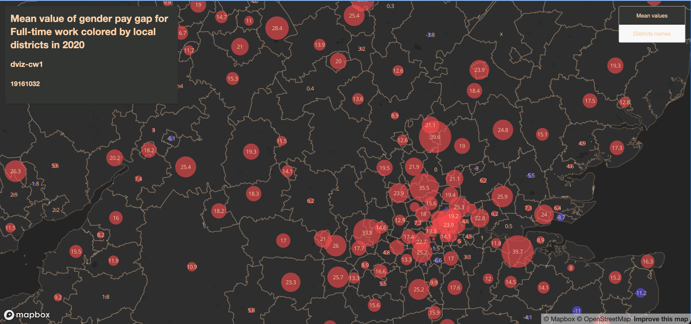
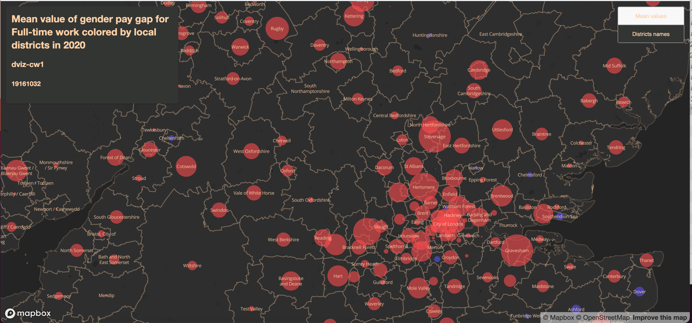

## Summary of Dviz coursework 1

##### 19161032

### 1. Aim

In recent years, as people's thinking has progressed, more and more people have become concerned about gender inequality in all aspects of daliy lives. One of the most talked about topics, equal pay for equal work. In the workplace, men are always paid more than women. Reducing the gender pay gap can contribute significantly to economic development and social progress. The reduction of this gap will not be achieved in the short term, so it is necessary to monitor its progress in real time and in different regions.

This report, is a visualisation of the gender income gap by local districts in the UK in 2020 with focus on full-time jobs. It is to present a direct view of the regional differences in gender income inequality. For example, areas with small differences will be studied for reasons why they are doing well, and areas where the problem is more severe will be targeted directly.

### 2. Data sources

The full-time gender pay gap of different local districts in 2020 is downloaded from the [ONS](https://www.ons.gov.uk/employmentandlabourmarket/peopleinwork/earningsandworkinghours/datasets/annualsurveyofhoursandearningsashegenderpaygaptables) website. It is the difference between average hourly earnings of male and female as a proportion of average hourly earning of male. That is to say, 1% means women earn 1% less compared to men averagely, while -1% denotes women earn 1% more. And this report use the mean value of the districts.

There are two kinds of Local Authority Districts (December Boundaries used in the work. One is the .csv file. The other is the .shp file. Both are downloaded from [ONS Open Geography Portal](https://geoportal.statistics.gov.uk/datasets/ae90afc385c04d869bc8cf8890bd1bcd_1/data?geometry=-71.873%2C46.019%2C67.082%2C63.435).

### 3. Design Outline - Proportional circles with colors

The original idea is to use proportional circles to represent the difference. The bigger the circle is, the larger the gap is. However, there exists negative values after exploring. So, use different color to distinct them. Therefore:
-  blue circles mean female earn more than male, while red circles mean male earn more than female;
-  purple circle for equality;
-  the size of circles denote the level of differences;

### 4. Technical Approach

#### 4.1 R: merge datasets

 As the files uploaded to Mapbox need geographical information like longtitudes and latitudes, which is not included in the original document of gender pay gap, it has to merge the pay gap file with the local authorities .csv file, which contains those information, by the corresponding GSS codes. This step is done by using R studio.

#### 4.2 Mapbox: draw circles

- upload the adjusted file done by R to Mapbox as tileset;
- import it three times as 'Circle' type;
- use 'Filter' function in the webstie to get positive layer, 0 layer and negatvie layer;
- mark them in differnt colors.
- adjust the radius of circles by different mean values;
- for neat view, also adjust by zoom level.

#### 4.3 Mapbox: preparation for selection button

- import the file twice as 'Symbol' type;
- use 'Text field' to select mean values and districts names and name the layer as these.

#### 4.3 Mapbox: draw districts boundaries

For better visualization, upload the .shp file as a layer to draw the local districts boundaries. And hide the boundaires and labels provided by the website. 

Notice this tileset data would partially disappear if zoom level is lower than 7. This has been discussed in [github](https://github.com/mapbox/mapbox-gl-js/issues/7113) but not solved.

#### 4.4 Html: map, title and button

- learnt from practical 2 to create the html file;
- use 'style' and 'div' to add title;
- use 'style' and 'script' to add button.

The click button is used to display the mean values or the districts names in the corresponding circles.

### 5. Screenshots of preview

#### 5.1 With Mean values

#### 5.2 With Districts names

